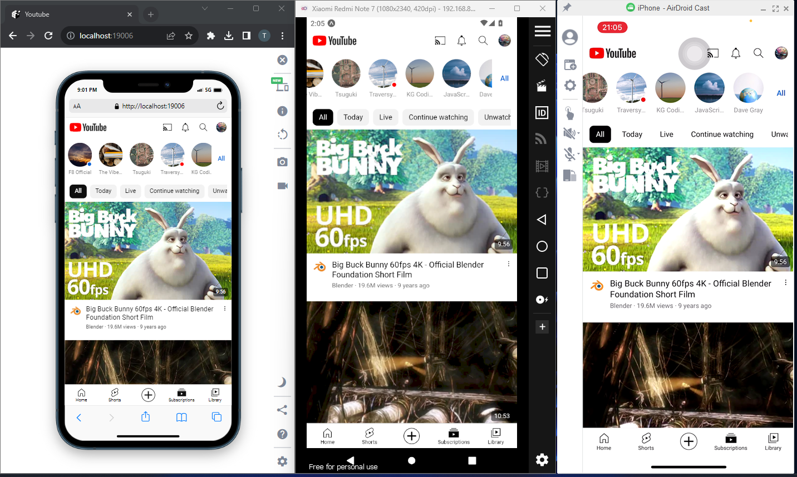
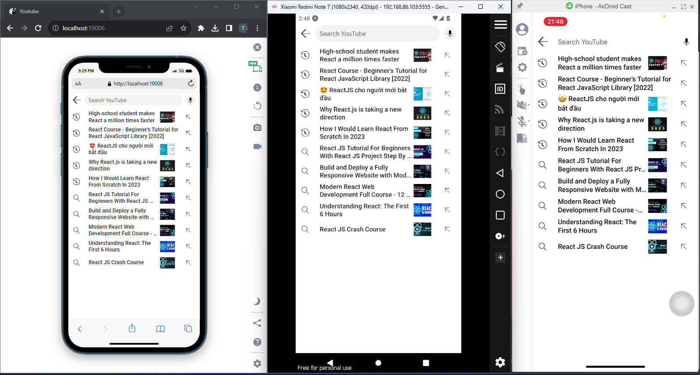

# YouTube Clone

## Introduction

## Table of Contents

-   [YouTube Clone](#youtube-clone)
    -   [Introduction](#introduction)
    -   [Table of Contents](#table-of-contents)
    -   [Features](#features)
    -   [Tech Stack](#tech-stack)
    -   [Run Locally](#run-locally)
    -   [Demo](#demo)
        -   [Home screen](#home-screen)
            -   [Filter All](#filter-all)
            -   [Filter New to you](#filter-new-to-you)
            -   [Filter Music](#filter-music)
            -   [Scroll](#scroll)
        -   [Subscriptions screen](#subscriptions-screen)
        -   [Search screen](#search-screen)
    -   [Authors](#authors)

## Features

-   ...

## Tech Stack

**Client:** React, React Native

## Run Locally

Clone the project

```bash
  git clone https://github.com/thaoanhhaa1/ReactNative_Youtube.git
```

Go to the project directory

```bash
  cd ReactNative_Youtube
```

Install dependencies

```bash
  npm install
```

Start project

```bash
  npm start
```

## Demo

### Home screen

#### Filter All


#### Filter New to you


#### Filter Music


#### Scroll


### Subscriptions screen



### Search screen



## Authors

-   [@thaoanhhaa1](https://github.com/thaoanhhaa1)
-   [@HoaiThuong178](https://github.com/HoaiThuong178)
